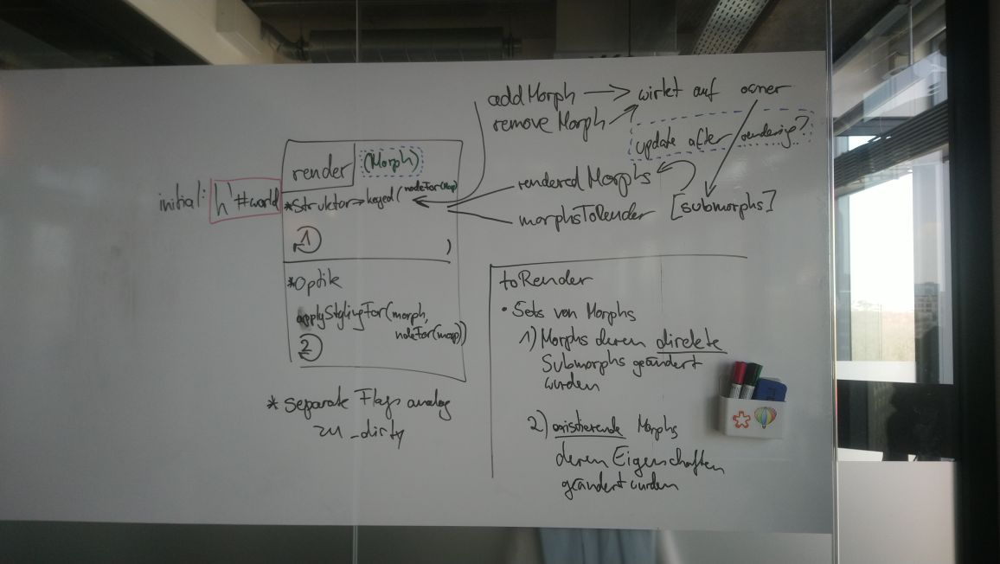

# stage0-morph

Towards a future without virtual-dom in lively.next.

## roadmap

### what we have

- render `Morph`, `Ellipse`, `Canvas`, `Image`
- render `HTML` morphs **without CSS** (just gets ignored atm)
- render morphs with JS layout
- render morphs with layouts that are rendered via CSS

### known missings

- we currently use separate flags for indicating the need to update the rendering of a morph. this should eventually just be `_dirty`

## Idea of the new stage0 renderer

### "Hooks"

Morphs can implement the following methods to customize their rendering:

- `renderStyles (styleProps)` gets passed the styleProps generated by feeding the morph to defaultStyles in the renderer. This object can then be customized. The return object of this function is then applied for the node style props.
- `renderAttributes(attrs)` see above, but for the other attributes of the node
- `getNodeForRenderer(renderer)` can be implemented and cause a special kind of dom node to be created for the rendering of the morph. The methods returning the dom nodes are to be implemented in the renderer. I.e., the `getNodeForRenderer` implementation on `Morph` just does `return renderer.nodeForMorph();`, with `nodeForMorph()` returning ``h`

`;``.

## Notes on the current render logic

### Rendering loop

The core rendering logic is implemented in the `Renderer` class in `lively.morphic`. When a world is loaded (`loadWorld()` in `lively.morphic/world-loading.js`) a Renderer is installed by calling `setWorld()` on the morphic environment. From `setWorld()`: `this.renderer ? this.renderer.rootNode : this.domEnv.document.body`.

In its constructor, `requestAnimationFrame` is installed on the renderer from the `window` such that `window` is bound to `this` inside of `renderer.requestAnimationFrame`.

After creating a `Renderer` the `renderLater()` function is invoked in `setWorld()` and kicks of the render loop, eventually executing `renderStep()` which will begin rendering with the `worldMorph` as rootnode. Each change to a morph that warrants a rerender will later call `makeDirty()`, causing another call to `renderLater()`.

### morphic.renderAsRoot()

Gets dispatched to `renderRootMorph` in `lively.morphic/morphic-default.js`. Initial creation of the actual domNodes gets handled here if necessary. For handling updates of rendered morphs, the `Renderer` has a `WeakMap` `renderMap` in which a mapping `Morph -> resulting vdomnode` is stored.

Thus, to render the world, the following steps are necessary:

1. Get the current vdom tree of the world from the `renderMap`.
2. Get an updated version of the vdom tree by calling `render(world)`.
3. Diff the old version of the tree and and the new version, generating a set of patches.
4. Patch the actual DOM, resulting in new vdom and actual DOM being consistent.

#### rendering of fixed Morphs

Fixed Morphs have a set position ("on the screen") and do not scroll with a world larger than the screen. E.g. side-bar flaps.
Only direct submorphs of the world can be rendered as fixed, for other morphs the `hasFixedPosition` flag has no purpose.

### renderer.render(morph)

Provides a mechanism to not rerender morphs for which a rerender is not necessary. If a rerender is due, call `render(renderer)` on the Morph to be rendered. Overall, a morph can be in the following states in the rendering process:

| State      | Related      |
| ----------- | ----------- |
|\_diry|needsRerender|
|\rendering|`aboutToRender`|
|"clean state"|`MorphAfterRenderHook`|

When `render` is called on a morph, master component styling is applied and the call gets dispatched back to `Renderer.renderMorph(morph)`. This function returns a vdomNode (using `h`), including all submorphs of the morph to be rendered as childnodes. This dispatch allows for a morph to a) take action themselfes when being rendered b) invoke another render function in the renderer as opposed to the default `renderMorph()`. This is what e.g. allows for native checkboxes to be rendered, by calling `renderCheckbox` which will create an `input` node instead of a `div`.

#### rendering of submorphs

There are two options for submorphs to be rendered. They come either wrapped or not wrapped. In the wrapped case, they get wrapped inside an additional `div` which has `position: absolute` set. This wrapping allows for layouting of morphs with javascript based layouts.

For layouts that are rendered via CSS, this wrapping is skipped.

#### installation of attributes and style

When creating the `div` with `h()` in `renderMorph()`, the style object of the vdom node are created by calling `defaultStyle(morph)`.

- CSS for layouts is installed if applicable
- the MorphAfterRenderHook gets installed on the node (see [here](https://github.com/Matt-Esch/virtual-dom/blob/dcb8a14e96a5f78619510071fd39a5df52d381b7/docs/hooks.md))

### rendering of fixed morphs

Morphs with a fixed position have a separate rendering mechanism, as they exist in a separate hierarchy, e.g. are not inside of the `div` representing the world.
That they exist outside of the "normal" rendering tree is the reason for why they are handled in a separate step.
When we go away from rendering with `virtual-dom` this is probably no longer necessary.

### `MorphAfterRenderHook`

`virtual-dom` executes these hooks directly after creating a DOM element.

Most parts of the hook wait until the resulting node is mounted:
When we have added a new submorph (only scenario in which `_submorphOrderChanged === true`) we call `updateScrollOfSubmorphs`. Only when this is not the case and we have a `clipMode` other than visible, we call `updateScroll` on the `Hook`. 

In case we are in the dom **and even in previous attemps**, if the Morph or its owner has a layout that gets renderer via `CSS`, `ensureBoundsMonitor` gets called on the layout.

#### updateScrollOfSubmorphs

Loops over submorphs of the morph and calls `updateScroll` on each of them **and their submorphs**.
#### updateScroll

When a scroll Event is dispatched, we store the new morphic property directly with the updated values from the event. We wait for some time until we tell the renderer that the scroll took place (`interactiveScrollInProgress`). The renderer then takes care of bringing the DOM back in sync with the morphic property.
This is what `updateScroll` is for which sets the scrollLeft and scrollTop properties of the DOM node to be in sync with the morphic property.

## LICENSE

MIT
